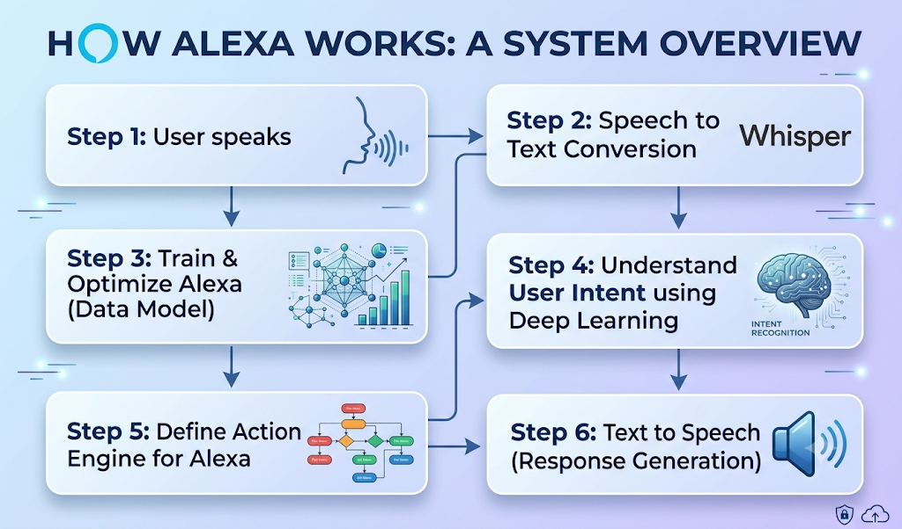
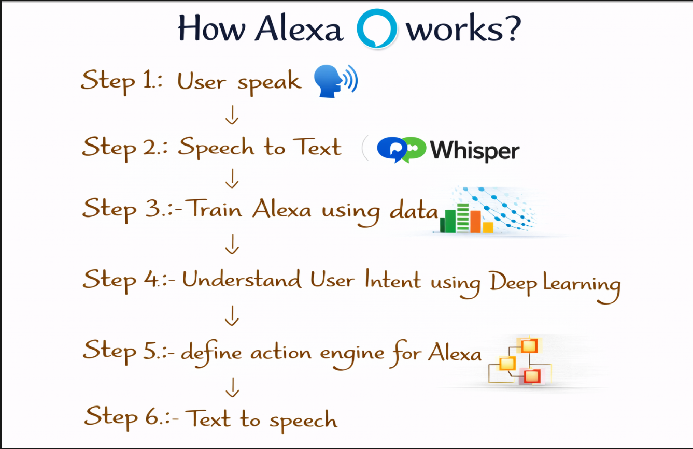
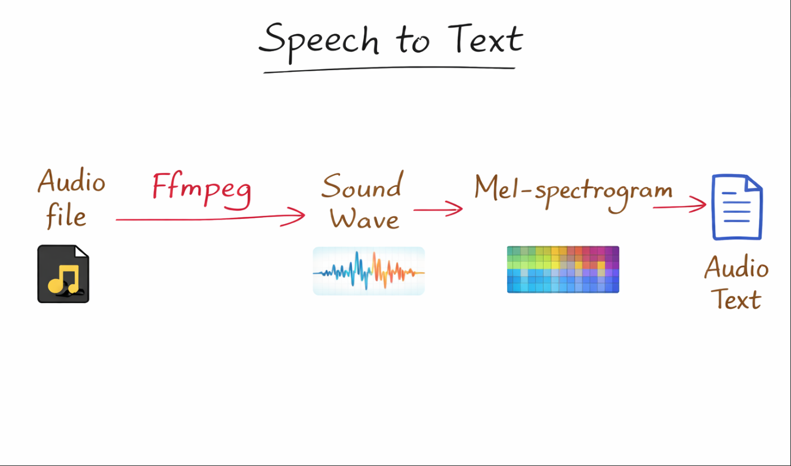
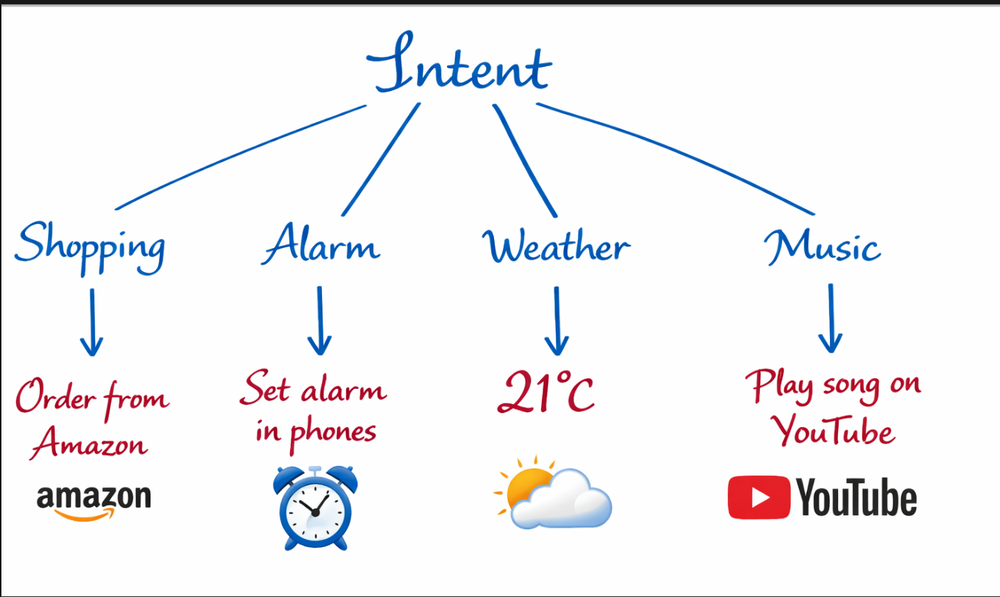

# 🧠 Alexa Voice Assistant

> An end-to-end voice assistant project combining **Speech Recognition, NLP, Machine Learning, and Voice Response**.



## 📌 Overview

This project is a **mini Alexa-style voice assistant** built to understand spoken commands, convert speech into text, identify the user's intent using a Machine Learning model, perform the appropriate action, and respond using speech.

The project focuses on understanding how different Data Science and AI components work together in a real-world application rather than treating each technology as an isolated concept.

### Core Pipeline

```text
🎤 User Voice
      ↓
🎙️ Audio Recording
      ↓
🧠 Whisper Speech Recognition
      ↓
📝 Transcribed Text
      ↓
🔤 TF-IDF Feature Extraction
      ↓
🤖 MLP Intent Classification
      ↓
🎯 Intent Detection
      ↓
⚙️ Action Engine
      ↓
💬 Response
      ↓
🔊 Text-to-Speech
````

---

## 🏗️ System Architecture



The assistant is designed as a multi-stage pipeline:

### 1. Speech Input

The user speaks through the computer microphone.

* `sounddevice` captures the audio.
* Audio is recorded as a WAV file.
* The recording uses a mono audio channel.
* The recorded file becomes the input for speech recognition.

### 2. Speech-to-Text



The recorded audio is processed using **OpenAI Whisper**.

Whisper converts:

```text
Audio → Speech Recognition → Text
```

For example:

```text
User speaks:
"Please open YouTube."

Whisper:
"Please open YouTube."
```

The project uses the **Whisper Base model** for speech recognition.

### 3. NLP & Intent Classification

The transcribed text is passed to the NLP pipeline.

```text
Text
 ↓
TF-IDF
 ↓
Numerical Feature Vector
 ↓
MLPClassifier
 ↓
Predicted Intent
```

### TF-IDF

`TfidfVectorizer` converts natural-language commands into numerical features that can be processed by a Machine Learning model.

For example:

```text
"play music"
        ↓
TF-IDF
        ↓
Numerical feature representation
```

### MLPClassifier

The project uses `MLPClassifier` to classify the user's command into an intent.

The model contains two hidden layers:

```text
Input Features
      ↓
50 Neurons
      ↓
25 Neurons
      ↓
Predicted Intent
```

The training data is stored in:

```text
alexa_data.csv
```

The dataset contains example prompts mapped to their corresponding intents.

---

## ⚙️ Action Engine



After the Machine Learning model predicts an intent, the **Action Engine** decides what action should be performed.

Examples include:

| Intent         | Action                        |
| -------------- | ----------------------------- |
| `play_music`   | Opens music search on YouTube |
| `open_website` | Opens requested websites      |
| `news`         | Opens Google News             |
| `date_time`    | Returns current date and time |
| `jokes_fun`    | Generates a random joke       |
| `general_qa`   | Performs a Google search      |

The architecture separates **intent prediction** from **action execution**, making the system easier to extend with additional capabilities.

---

## 🔊 Text-to-Speech

After the action is completed, the assistant generates a text response.

The response is passed to **pyttsx3**, which converts the text into spoken audio.

```text
Action
  ↓
Response Text
  ↓
pyttsx3
  ↓
🔊 Voice Output
```

This completes the interaction cycle:

```text
Voice → Text → Intent → Action → Response → Voice
```

---

## 🧠 Machine Learning Component

The ML component is based on supervised text classification.

### Training Pipeline

```text
alexa_data.csv
      ↓
Prompt + Intent
      ↓
TF-IDF Vectorization
      ↓
Feature Matrix
      ↓
MLPClassifier
      ↓
Trained Intent Model
```

### Inference Pipeline

```text
New Voice Command
      ↓
Whisper
      ↓
Transcribed Text
      ↓
TF-IDF Transform
      ↓
MLPClassifier
      ↓
Predicted Intent
```

An important distinction in the project is that TF-IDF performs **feature extraction**, while the MLP performs **classification**.

---

## 🛠️ Technologies Used

### Programming

* Python

### Speech Recognition

* OpenAI Whisper

### Natural Language Processing

* TF-IDF
* Text preprocessing
* Intent classification

### Machine Learning

* Scikit-learn
* MLPClassifier

### Audio Processing

* SoundDevice
* SciPy
* FFmpeg

### Text-to-Speech

* pyttsx3

### Web Application

* Streamlit

### Data Handling

* Pandas
* CSV

### Automation / Interaction

* Webbrowser
* PyAutoGUI

---

## 📂 Project Structure

```text
BuildingAlexa_Voice_Assistance/
│
├── PY/
│   └── alexa.py
│
├── IPYNB/
│   └── Alexa_Voice_Assistant.ipynb
│
├── alexa_data.csv
│
├── system_overflow.png
├── Project_arch.png
├── Speech_to_text.png
├── action_engine.png
│
├── input2.wav
│
├── .gitignore
└── README.md
```

> `ffmpeg/` is used locally for audio processing and is excluded from Git tracking through `.gitignore`.

---

## 🚀 How It Works

### Step 1 — Record Voice

The user speaks a command through the microphone.

### Step 2 — Save Audio

The recorded speech is saved as a WAV file.

### Step 3 — Transcribe Speech

Whisper processes the audio and generates text.

### Step 4 — Extract Features

TF-IDF converts the text into a numerical representation.

### Step 5 — Predict Intent

The trained MLP classifier predicts the user's intent.

### Step 6 — Perform Action

The Action Engine maps the predicted intent to the corresponding action.

### Step 7 — Generate Response

The assistant generates a response based on the performed action.

### Step 8 — Speak Response

pyttsx3 converts the response into speech.

---

## 💻 Example Interaction

```text
User:
"Please open YouTube."

        ↓

Whisper:
"Please open YouTube."

        ↓

TF-IDF:
Text → Feature Vector

        ↓

MLPClassifier:
Predicted Intent → open_website

        ↓

Action Engine:
Open YouTube

        ↓

Alexa:
"Opening YouTube"

        ↓

🔊 Voice Response
```

---

## 🎯 Project Objectives

This project was developed to understand how multiple AI and Data Science components can be integrated into one working application.

### Key learning objectives

* Understand speech-to-text systems
* Work with pretrained speech recognition models
* Perform NLP feature extraction
* Build a text classification pipeline
* Train an MLP neural network
* Connect Machine Learning predictions to real-world actions
* Work with audio input and output
* Build an interactive Streamlit application
* Understand end-to-end AI application architecture

---

## 📊 Dataset

The project uses a custom intent dataset:

```text
alexa_data.csv
```

Each training example contains:

```text
Prompt → Intent
```

Example:

```text
"wake me up" → alarm
"play some music" → play_music
"open YouTube" → open_website
```

The dataset contains multiple intent categories covering different types of assistant commands.

---

## 🔬 Data Science Perspective

Although this project is an application-focused AI system, it also demonstrates several important Data Science concepts:

* Data preparation
* Text preprocessing
* Feature extraction
* TF-IDF
* Supervised learning
* Neural-network classification
* Model training
* Model inference
* Prediction-to-action mapping
* End-to-end pipeline design

The project separates the **ML pipeline** from the **application/action layer**, which makes the architecture easier to understand and extend.

---

## 🔮 Future Improvements

The current system provides a foundation that can be expanded into a more capable personal assistant.

Possible improvements include:

* Add more intents and actions
* Improve intent classification accuracy
* Add train/test splitting and evaluation metrics
* Generate a confusion matrix
* Perform error analysis
* Add confidence thresholds for uncertain predictions
* Save and reload the trained ML model
* Build a complete automated ML pipeline
* Add conversational memory
* Integrate APIs for weather, news, and other services
* Improve speech recognition for noisy environments
* Add multilingual support
* Add wake-word detection
* Add more computer-control capabilities
* Deploy the application online

---

## 📈 Future ML Evaluation

A stronger version of the ML component can evaluate the classifier using:

```text
Accuracy
Precision
Recall
F1-Score
Confusion Matrix
Classification Report
```

This would allow the project to move beyond simply demonstrating predictions and provide a more complete Machine Learning evaluation.

---

## 🧩 Key Architecture Principle

The most important idea behind this project is the separation of responsibilities:

```text
Speech Recognition
        ↓
Natural Language Processing
        ↓
Machine Learning
        ↓
Decision / Intent
        ↓
Action
        ↓
Response
        ↓
Speech
```

Each stage has a specific responsibility, allowing individual components to be improved without redesigning the entire system.

---

## 📌 Current Project Status

### Implemented

* [x] Microphone audio recording
* [x] WAV audio processing
* [x] Whisper speech-to-text
* [x] TF-IDF feature extraction
* [x] MLP intent classification
* [x] Intent-based action engine
* [x] Browser automation
* [x] Text-to-speech response
* [x] Streamlit interface
* [x] Local FFmpeg integration
* [x] End-to-end voice interaction

### Planned

* [ ] Expanded intent-action coverage
* [ ] Formal ML evaluation
* [ ] Confusion matrix
* [ ] Error analysis
* [ ] Confidence-based predictions
* [ ] Model persistence
* [ ] Additional APIs and assistant capabilities

---

## 👩‍💻 About the Project

This project is part of my journey of learning **Data Science, Machine Learning, NLP, and AI by building practical systems**.

Rather than using Machine Learning as an isolated notebook exercise, the goal was to understand how a trained model can become part of a complete application:

```text
Data → Model → Prediction → Decision → Real-World Action
```

---

## ⭐ Why This Project?

A voice assistant may look simple from the outside, but internally it combines several different technologies:

* Audio processing
* Speech recognition
* Natural Language Processing
* Machine Learning
* Neural networks
* Automation
* Text-to-speech
* Application development

Building the project helped connect these concepts into one end-to-end system.

---

## 📬 Connect

If you are interested in **Data Science, Machine Learning, NLP, AI applications, or practical ML projects**, feel free to explore the repository and connect with me.

⭐ If you find this project useful, consider giving the repository a star.

---

## 📄 License

This project is intended for educational and portfolio purposes.


